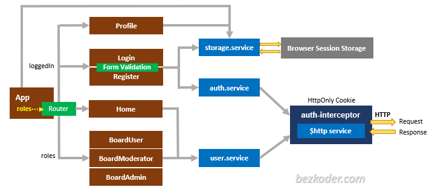

#Proyecto Integrador Portfolio Web Full Stack
#YoProgramo

#Objetivo
Desarrollar una aplicación web full stack, que mostrará: tus datos personales, estudios cursados, experiencia laboral, conocimiento de las
tecnologías y proyectos. Es decir, ¡crear tu propio portfolio web! Esta aplicación deberá ser de arquitectura distribuida y contener un
diseño de interface (front end) que muestre la información, una base de datos que almacene los datos antes mencionados y debe contar con las APIs necesarias para proveer a través de internet la información (back end).

#Estado
-El proyecto esta terminado, se hicieron algunos cambios con respecto al proyecto que piden, en este caso la pagina no servira para un solo usuario (que editará su portfolio) sino que podran registrarse todos los usuarios que quieran clickenado el boton "Sign Up".
-Al poder registrarse mas de un usuario, en la pagina principal (/home), habra una busqueda para poder ver los portfolios de todos los usuarios registrados en la pagina.
-Tambien estara la opcion de menu "User" que informara el Rol que tiene el usuario (User, Admin, Etc.)
-Por cada sección (Educacion, Exp.Laboral, datos personales, conocimientos y proyectos) se podra realizar las operaciones CRUD.

#Tecnologias de desarrollo
-Se utilizo para el FrontEnd: HTML. CSS, JavaScript, TypeScript, Boostrap y Angular.
-Como Base de datos MySQL 8.
-Para el Backend Java y spring boot, Aplicando JWT (se deja debajo un resumen en ingles de Autenticación de Angular 13 JWT con Web API y ejemplo de Cookie HttpOnly).

Build Angular 13 JWT Authentication & Authorization example with Web Api, HttpOnly Cookie and JWT (including HttpInterceptor, Router & Form Validation).
- JWT Authentication Flow for User Registration (Signup) & User Login
- Project Structure with HttpInterceptor, Router
- Way to implement HttpInterceptor
- How to store JWT token in HttpOnly Cookie
- Creating Login, Signup Components with Form Validation
- Angular Components for accessing protected Resources
- How to add a dynamic Navigation Bar to Angular App
- Working with Browser Session Storage

## Flow for User Registration and User Login
For JWT – Token based Authentication with Web API, we’re gonna call 2 endpoints:
- POST `api/auth/signup` for User Registration
- POST `api/auth/signin` for User Login

You can take a look at following flow to have an overview of Requests and Responses that Angular 13 JWT Authentication & Authorization Client will make or receive.

## Angular JWT App Diagram with Router and HttpInterceptor

For more detail, please visit the tutorial:
> [Angular 13 JWT Authentication with Web API and HttpOnly Cookie example](https://www.bezkoder.com/angular-13-jwt-auth-httponly-cookie/)

## With Spring Boot back-end

> [Angular + Spring Boot: JWT Authentication and Authorization example](https://www.bezkoder.com/angular-13-spring-boot-jwt-auth/)

Run `ng serve --port 8081` for a dev server. Navigate to `http://localhost:8081/`.

## More practice
> [Angular JWT Auth with JWT (on Authorizaton Header) and Web API example](https://www.bezkoder.com/angular-13-jwt-auth/)

> [Angular CRUD Application example with Web API](https://www.bezkoder.com/angular-13-crud-example/)

> [Angular Pagination example | ngx-pagination](https://www.bezkoder.com/angular-13-pagination-ngx/)

> [Angular File upload example with Progress bar](https://www.bezkoder.com/angular-13-file-upload/)

Fullstack with Spring Boot:

> [Angular + Spring Boot + H2 Embedded Database example](https://www.bezkoder.com/spring-boot-angular-13-crud/)

> [Angular + Spring Boot + MySQL example](https://www.bezkoder.com/spring-boot-angular-13-mysql/)

> [Angular + Spring Boot + PostgreSQL example](https://www.bezkoder.com/spring-boot-angular-13-postgresql/)

> [Angular + Spring Boot + MongoDB example](https://www.bezkoder.com/angular-13-spring-boot-mongodb/)

> [Angular + Spring Boot: File upload example](https://www.bezkoder.com/angular-13-spring-boot-file-upload/)

Serverless with Firebase:
> [Angular Firebase CRUD with Realtime DataBase | AngularFireDatabase](https://www.bezkoder.com/angular-13-firebase-crud/)

> [Angular Firestore CRUD example with AngularFireStore](https://www.bezkoder.com/angular-13-firestore-crud-angularfirestore/)

> [Angular Firebase Storage: File Upload/Display/Delete example](https://www.bezkoder.com/angular-13-firebase-storage/)

Integration (run back-end & front-end on same server/port)

> [How to Integrate Angular with Spring Boot Rest API](https://www.bezkoder.com/integrate-angular-12-spring-boot/)

#Tecnologias necesarias

-Hardware -> PC o notebook, puede abrir la pagina con una tablet o celular pero no esta preparado para ese tipo de tecnologias movile por lo que podria sueceder que no se vea bien la pagina (diseño responsive no preparado para sistema movile).
-Un navegador (Chrome, Firefox, Edge, etc.)
-java virtual machine y SDK 17.

#Documentación extra
Archivo siguientes:
-Arquitectura WEB
-Plantilla Product Backlog
-Plantilla Spring Backlog
-Plantilla Historia de Ususario